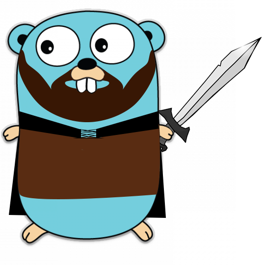

<p align="center">
 
</p>

# GO Ranger [](https://travis-ci.org/foodora/go-ranger)

A Golang toolkit/set of libs to build standardized apps

# Before you start

Run `dep ensure` to download all dependencies

# How it works

See all features on ```example.go```

# Libraries used

See ```Gopkg.toml```
